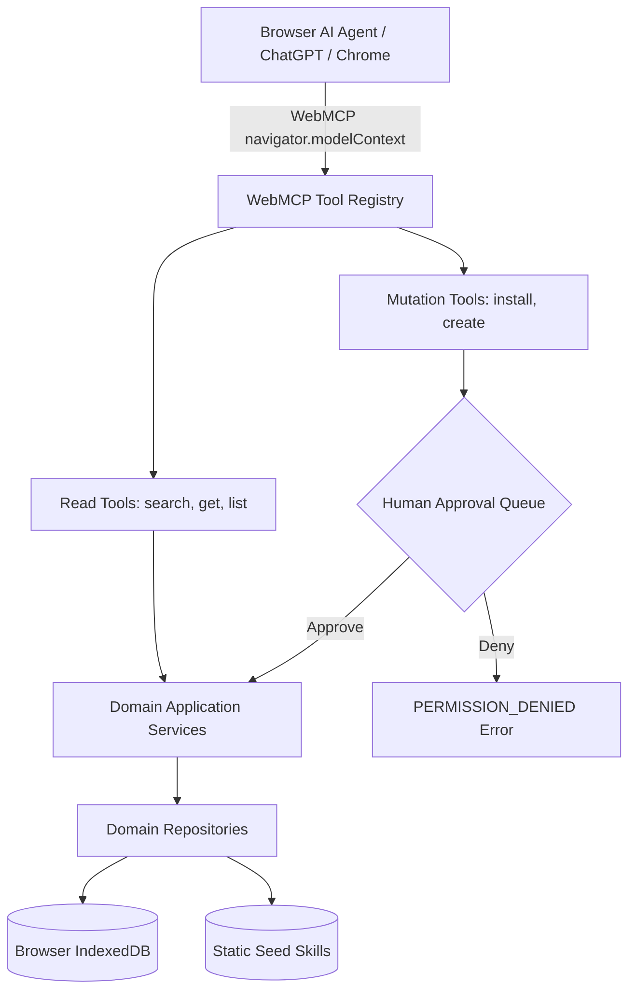

# Skill Browser ⚡ WebMCP Skill Registry for AI Agents

> A browser-native AI skill discovery platform and personal Skillspace powered by **WebMCP** (`navigator.modelContext`).

[](https://nextjs.org/)
[](https://www.typescriptlang.org/)
[](https://github.com/GoogleChromeLabs/webmcp)
[]()
[]()

---

## 🎯 The Problem

Browser-based AI agents (such as ChatGPT in-app browser or Chrome WebMCP) need specialized instructions and domain context to perform complex workflows. Today, developers suffer from:
1. **Context Window Bloat**: Shoveling megabytes of static prompts into agent prompts on every request.
2. **Silent Mutation Hazards**: Agents modifying user state or tools without explicit human oversight.
3. **Infrastructure Tax**: Requiring expensive server-side vector databases or paid cloud APIs merely to search skills.

---

## 💡 The Solution: Skill Browser

**Skill Browser** is a local-first, zero-paid-backend skill discovery engine and personal Skillspace manager:

* **Progressive Disclosure**: Agents query lightweight metadata first (`search_skills`, `get_skill_metadata`), downloading full instructions (`get_skill`) only when needed.
* **Human-in-the-Loop Security Gate**: State mutations (`install_skill`, `create_collection`) are intercepted by a real-time browser approval queue requiring explicit human approval.
* **Local-First IndexedDB Persistence**: Skills, custom collections, and preferences are persisted directly in the browser with JSON export/import support.
* **Universal Agent Simulator**: Judge and developer verification playground (`/simulator`) to test WebMCP tools in any standard browser.

---

## 🛠️ WebMCP Tool Specifications

Skill Browser exposes 6 contract-first WebMCP tools via `navigator.modelContext`:

### 1. Read Tools (Token Efficient)
| Tool | Description |
| :--- | :--- |
| `search_skills` | Deterministic keyword and category search returning compact summaries (~150 tokens). |
| `get_skill_metadata` | Inspects author, version, compatibility, and integrity hash without prompt bodies. |
| `get_skill` | Retrieves complete sanitized Markdown instruction manifest and reference links. |
| `list_my_skills` | Queries user's active local Skillspace and custom collections. |

### 2. Mutation Tools (Human Approval Guarded)
| Tool | Description | Permission Policy |
| :--- | :--- | :--- |
| `install_skill` | Adds a registry skill to the user's local Skillspace. | 🛡️ **Human Approval Required** |
| `create_collection` | Creates a new named collection in Skillspace. | 🛡️ **Human Approval Required** |

---

## 🏗️ Architecture & Boundaries



* **Zero Arbitrary Eval**: Imported skills are strictly sanitized markdown (`sanitizeMarkdown`). Script tags, iframes, and dangerous URIs are stripped.
* **Domain Decoupling**: Application services interact only via domain repository interfaces. Adapters never import UI components.

---

## 🚀 Quickstart & Local Development

### Prerequisites
* Node.js 20+
* pnpm (`npm install -g pnpm`)

### Installation
```bash
# Clone the repository
git clone https://github.com/your-repo/skill-browser.git
cd skill-browser

# Install dependencies
pnpm install

# Start local development server
pnpm dev
```
Open [http://localhost:3000](http://localhost:3000) in your browser.

### Quality Assurance & Verification
```bash
# Format and lint with Biome
pnpm lint

# Strict TypeScript typechecking
pnpm typecheck

# Production build
pnpm build
```

---

## 🎮 How to Test with the Agent Simulator

1. Visit `/simulator` in Skill Browser.
2. Select **Scenario 1 (Global Skill Discovery)** to watch an agent search skills.
3. Select **Scenario 4 (Human-Gated State Mutation)** to trigger the real-time permission dialog.
4. Click **Approve** or **Deny** to observe the agent receiving structured responses in real time.

---

## 📄 License
MIT License. Built for the **WebMCP Challenge 2026**.
