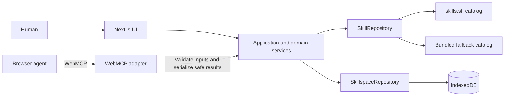

# Skill Browser

> A browser-native skill registry and personal Skillspace for AI agents, powered by WebMCP and controlled by the human using it.

[](https://nextjs.org/)
[](https://www.typescriptlang.org/)
[](#architecture)
[](#product-principles)

## Vision

Skill Browser is a place where people can discover, inspect, install, organize, and share reusable instructions for browser-based AI agents. Instead of copying large prompts into every conversation, an agent can discover concise skill metadata through WebMCP and retrieve the complete instructions only when they are relevant.

The product is **agent-first and human-controlled**:

- Humans curate the skills available in their personal Skillspace.
- Agents discover and retrieve those skills through narrow, typed WebMCP tools.
- The browser is the trust and permission boundary.
- Skill content is always treated as untrusted data, never executable code.
- Agent-requested mutations require an explicit, visible user decision.

The long-term goal is an open skill ecosystem that works across browser-based agents without requiring a proprietary runtime, paid AI API, or paid database.

## Product experience

Skill Browser is designed around three short paths:

1. **Discover:** search the public registry by name, description, category, or tag, then inspect a skill's source, version, license, and instructions.
2. **Curate:** add skills to a local Skillspace, organize them into collections, import custom skills, and keep control of what agents can access.
3. **Use with an agent:** open the Skillspace in a WebMCP-capable browser so an agent can search metadata and retrieve the right skill on demand.

WebMCP support is feature-detected. The application remains usable as a normal skill browser when `navigator.modelContext` is unavailable.

## Product principles

- **Progressive disclosure:** return compact metadata first and full instructions only when requested.
- **Human control:** reads are the default; mutations are visible and approval-gated.
- **Provenance first:** show where a skill came from before asking a user to trust or install it.
- **Local first:** keep the anonymous personal Skillspace in IndexedDB behind a repository interface.
- **Contract first:** validate external input with Zod and derive strict TypeScript types from those schemas.
- **Deterministic by default:** search and application behavior should not depend on hidden AI calls.
- **Portable architecture:** domain services do not depend on React, Next.js, WebMCP, or a storage vendor.

## Current WebMCP interface

The current browser adapter exposes a deliberately read-only agent surface:

| Tool | Purpose |
| --- | --- |
| `search_skills` | Search the registry and return compact skill summaries. |
| `get_skill_metadata` | Inspect provenance and compatibility without loading instruction content. |
| `get_skill` | Retrieve a validated, sanitized skill when the full instructions are needed. |
| `list_my_skills` | List the skills available in the current local Skillspace. |

The product architecture also supports mutation tools such as `install_skill`, but those belong behind a pending-approval flow: request, explain the consequence, wait for the user to allow or deny it, and only then update local state.

## Architecture



The repository is organized around replaceable boundaries:

```text
src/
├── app/                 Next.js App Router entry points
├── components/          UI and product components
├── contracts/           Zod schemas and inferred TypeScript types
├── domain/              Services, policies, and repository interfaces
├── infrastructure/      Registry, storage, import, and WebMCP adapters
├── lib/                 Shared utilities and sanitization
└── styles/              Semantic design tokens
```

Both the UI and WebMCP adapter call the same application services. Domain code stays independent of UI and infrastructure, while repository interfaces keep the live catalog, bundled data, IndexedDB, and any future persistence replaceable.

## Trust and security

Skills can contain prompt injection, unsafe links, malformed Markdown, or misleading provenance. Skill Browser therefore follows these constraints:

- Validate all external inputs and manifests at runtime.
- Sanitize Markdown before rendering or returning it to an agent.
- Never evaluate skill content or execute arbitrary skill code.
- Never expose cookies, tokens, secrets, or unrelated local files to skills.
- Restrict imports to validated public HTTPS sources with size and redirect limits.
- Return stable, agent-safe error codes without internal stack traces.
- Require explicit user approval before an agent changes Skillspace state.

## Local development

### Prerequisites

- Node.js 20 or newer
- [pnpm](https://pnpm.io/) 10

### Start the app

```bash
pnpm install
pnpm dev
```

Open [http://localhost:3000](http://localhost:3000).

### Live skills.sh catalog

The home page uses the official skills.sh API as its primary catalog. Its Vercel OIDC token remains inside the server-side route handler and is never exposed to the browser.

1. Enable OIDC Federation in the Vercel project settings.
2. Link the local project with `vercel link`.
3. Run `vercel env pull` to populate `VERCEL_OIDC_TOKEN` in `.env.local`.

Without OIDC, the app falls back to its bundled catalog. Personal skills remain local-first in IndexedDB in either mode.

## Project documentation

- [Product scope](docs/product-scope.md) — MVP boundaries, user flows, permissions, and post-MVP direction.
- [Architecture](docs/architecture.md) — layers, data flow, contracts, adapters, security, and persistence.
- [Design system](docs/design-system.md) — visual language, tokens, accessibility, and component rules.
- [UI/UX specification](docs/ui-ux.md) — screens, interaction patterns, trust UX, and responsive behavior.
- [Roadmap](docs/roadmap.md) — milestone sequence and definitions of done.
- [Implementation plan](docs/implementation-plan.md) — stack decisions and delivery order.

## License

MIT License. Built for the WebMCP Challenge 2026.
